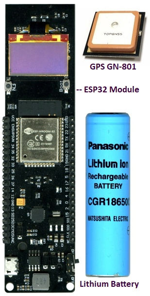
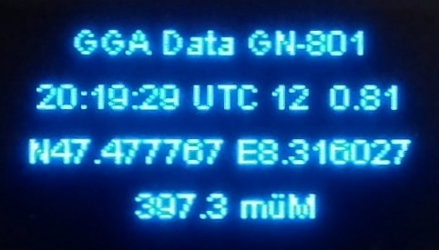

# GPS_GN-801
Reads the NMEA sentences from a GPS decodes and displays them
on the OLED of the ESP32 module.
In this example code only the $GNGGA sentence is evaluated.
## Parts

## Displayed Data

## Code
The folder GPS_GN-801 contains the full PlatformIO project.
